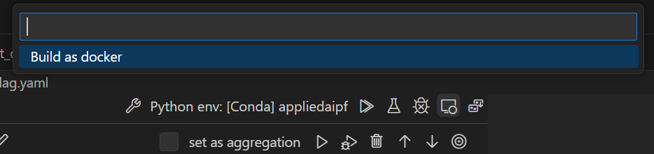

# Promptflow rag project template

The overall intention of this repo is to host the end-to-end process for building RAG applications, showcasing development, evaluation, experimentation, and deployment aspects using PromptFlow, Azure AI Studio, and other Azure data products.

The repo is currently hosting a single use-case on using PromptFlow and Azure AI for development, evaluation, and deployment of a RAG-based chatbot for question and answering on financial transcripts. In this sample, we also demonstrate how to use other Azure database offerings for vector searches. 

### Prerequisites
Before you begin, ensure that you have the following installed on your machine:

Python 3.9 or later,  VSCode, PromptFlow for VSCode extension, Docker

## Walkthrough: RAG on financial transcripts sample 


### Steps

a. steps to run rag app locally in your vscode:

1) Set up your dev environment:
Install miniconda for your environment, here is the link for [windows miniconda](https://docs.conda.io/projects/miniconda/en/latest/index.html). Run the following command
`conda env update -f environment.yaml`
2) Install [azure-cli](https://learn.microsoft.com/en-us/cli/azure/install-azure-cli-windows?tabs=azure-cli) if you haven't already. Do `az login`. 
3) Make a copy of `.env.sample` and rename it to `.env`. You can use this file to decide to use keys from this file or azure keyvault. The keys will be used for preprocessing in step 3 and creating connections for promptflow in step 4.
```bash
# Use .env or keyvault. ENV or empty = .env, KEYVAULT = keyvault
KEYS_FROM="ENV"
KEY_VAULT_NAME=""
```
> NOTE: Our convention is that variables from keyvault have a (-), but from a `.env` has a (_) like `OPENAI-API-BASE` vs. `OPENAI_API_BASE`
4) cd to the `preprocessing/` folder and start running the preprocessing notebooks to create a new vector database index if you haven't done so already.
5) Create connections for ACS, AOAI, etc by running python code in `connections/` directory.
6) Go to `rag-<vector-search>` directory, open flow.dag.yaml visually, then choose the connections that you have created in any specific nodes that are complaining with a warning. 

For vector search, you may use azure search, or native vector search capabilities of cosmosdb offerings such as postgres. Currently, we included complete flows for azure-search (previously azure cognitive search), cosmosdb mongodbvcore, and postgres as shown in rag-azure-search, rag-cosmos-mongo, and rag-cosmos-postgres directories, respectively. 

7) Run or build locally to deploy the app and interact with the bot in your local environment. 

Note: You will find two yaml files in the 'rag-copilot' folder. The flow.dag.yaml is the main yaml file that orchestrates various app components, such as retreivals, llm calls, etc. In addition, you will find the hyperparameters of the flow inside the param_config.yaml. As an example, the changes you make to topK in param_config.yaml file will be reflected in the flow.dag.yaml at the run time. 

Known issue: In addition to end-to-end running and debugging, promptflow allows single node runs for tests and debugging. However, please be aware that node running on its own that depend on configloader node will not work today. 

b. Steps for batch evaluation in vscode:

1) Go to `rag-<vector-search>` directory, open flow.dag.yaml. 
2) Click batch run 
3) When selecting input source, choose evalset.csv.
4) Then choose the data mapping on the run yaml file. 
You may either delete topK and maxTokens to use default values or provide integers for the desired values. Do not select them from data mapping as they will not be available
5) The click run on the yaml file. 
Once the run is completed, then you need to
6) Go to evaluator directory and choose one of the folders and open the flow.dag.yaml file. Note that each folder presents one or many evaluation metrics.   
7) Click the batch run to start an evaluation flow. 
8) when prompted, choose "existing run" since we are going to use the results of the main rag flow for the evaluation flow. 
9) Choose the run in step 5 of the evaluation 
10) This will create a run yaml file. You need to uncomment the data to be able to chose the evalset.csv again. You may need to use some columns such as ground truth answers. 
11) Choose the column mapping for the necessary inputs.
12) Note the name of the output file in your terminal.
13) Click on the promptflow icon on the left ribbon of vscode
14) Go to "Batch Run History" section and choose your recent run(s), then click on the Visualize.

Note: You will find two yaml files in the `rag-<vector-search>` directories. The flow.dag.yaml is the main yaml file that orchestrates various app components, such as retreivals, llm calls, etc. In addition, you will find the hyperparameters of the flow inside the param_config.yaml. As an example, the changes you make to topK in param_config.yaml file will be reflected in the flow.dag.yaml at the run time. 

Known issue: In addition to end-to-end running and debugging, promptflow allows single node runs for tests and debugging. However, please be aware that node running on its own that depend on configloader node will not work today. 

c. Steps for experimentation in vscode:

1) Similar to step a.3 open the flow.dag.yaml file. Locate a prompt node and clone it. It will create a new variant and associated jinja file. Make the changes to the prompt in the jinja file. You may also make the changes to the openai variables such as temperature in the cloned node in the flow.dag.yaml. You may create multiple variants for cloneable nodes. Then save the file. 
2) Finally, go through all the steps for the batch evaluations again to obtain evaluations for all the variants and compare the results. 

d. Steps for batch experimentation using python SDK:
1) Go to experimentation directory and chose the subdirectory based on your choice of vectorsearch services.   
1) Open batchRunEvaluations.ipynb notebook and run through cells. Note: to setup the configs for the batch experimentation runs, you may modify run_config.yaml file for batch evaluations on several configurations as you may find in the last section of the notebook. 
* Note: the notebook is setup to use evalset.csv, which contains 10 human-curated pairs of questions and answers. Please refer to the [readme file in the datasets subdirectory](\financial_transcripts\datasets\readme.md) for alternative datasets. 


e. Steps for docker deployment:

pre-requisite: Docker. You can get docker from [here](https://www.docker.com/get-started/).

1) Change directory to sample folder (e.g. financial_transcripts)
2) Use the command below to recreate your llm app as a docker format or click the vscode build option:
```bash
pf flow build --source ./rag-<vector-search> --output deploy --format docker
```
>Note: replace vector-search with one of available search options: (1)azure-search (2)cosmos-mongo (3)cosmos-postgres

>Note: the deploy folder is where the llm app is packaged. 



3) Inspect the requirement.txt file in the 'deploy/flow' directory. 

4) Inspect the connection files in the 'deploy/connections' and double-check information such as api_base and api_version.

5) Build the docker image file by running the following command in the `financial_transcipts/` folder.
```docker build deploy -t rag-app-serve```

6) Run with docker run. Make sure to add secret values in the command below:

```
docker run -p 8080:8080 -e AOAI_CONNECTION_API_KEY=<secret-value> -e ACS_CONNECTION_API_KEY=<secret-value> rag-app-serve
```
>Note: check the port mapping and change if needed. 

7) Finally inspect the end point. 
In you local machine, you may inspect your app in a browser: http://localhost:8080/

f. steps for webapp deployment 

>First, you need to provision an azure container registry and an app service plan. Then follow steps from promptflow's official documentations for webapp deployment: https://microsoft.github.io/promptflow/cloud/azureai/deploy-to-azure-appservice.html. 

>If you wish to use azure cli, please refer to the instructions in [Deployment via Azure CLI Instructions](financial_transcripts\deployment_utilities\webapp_deployment\deploy_via_azure_cli_instructions.md) for provisioning and deploying your webapp. 

Please note that you if you have your own frontend, you can use the deployed web app as an endpoint and integrate with your frontend. See example snippet below for making requests. 

```
import requests  
import json  
url = 'https://<RAG-WEBAPP-NAME>.azurewebsites.net/score'
  
data = {
    "query": "what was azure ML revenue in FY23Q2?"
}  
headers = {"Content-Type": "application/json"}  
response = requests.post(url, data=json.dumps(data), headers=headers)  
print(response.text)
```

> NOTE: additional information about client interaction with promptflow serving and streaming can be found at `financial_transcripts/deployment_utilities/test_client`


## Alternative Azure Vector databases

Microsft azure databases, such as cosmosdb mongodb vcore or postgres flex, also offer vector search capabilities that could be used in lieu of azure search. Please refer to vectordb-tools directory for the instructions.

## Developer guide

For any contributions, please make sure to check the Python formatting with Black formatter. 

## Contributing

Let's Expand this repo to interesting and more complex rag-applications. 

This project welcomes contributions and suggestions.  Most contributions require you to agree to a
Contributor License Agreement (CLA) declaring that you have the right to, and actually do, grant us
the rights to use your contribution. For details, visit https://cla.opensource.microsoft.com.

When you submit a pull request, a CLA bot will automatically determine whether you need to provide
a CLA and decorate the PR appropriately (e.g., status check, comment). Simply follow the instructions
provided by the bot. You will only need to do this once across all repos using our CLA.

This project has adopted the [Microsoft Open Source Code of Conduct](https://opensource.microsoft.com/codeofconduct/).
For more information see the [Code of Conduct FAQ](https://opensource.microsoft.com/codeofconduct/faq/) or
contact [opencode@microsoft.com](mailto:opencode@microsoft.com) with any additional questions or comments.

## Trademarks

This project may contain trademarks or logos for projects, products, or services. Authorized use of Microsoft 
trademarks or logos is subject to and must follow 
[Microsoft's Trademark & Brand Guidelines](https://www.microsoft.com/en-us/legal/intellectualproperty/trademarks/usage/general).
Use of Microsoft trademarks or logos in modified versions of this project must not cause confusion or imply Microsoft sponsorship.
Any use of third-party trademarks or logos are subject to those third-party's policies.
